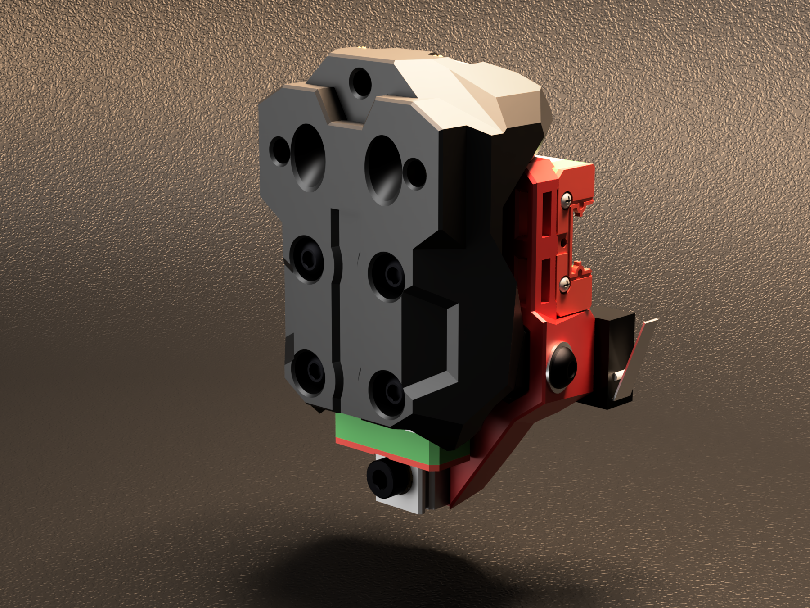

# Boop

Add nozzle probing to your [Printer For Ants](https://www.3dprintersforants.com).

Boop is a down-scaled version of the [Voron Tap](https://github.com/VoronDesign/Voron-Tap/) nozzle-based Z probe, and has been carefully optimized for [Printers for Ants](https://3dprintersforants.com) that have front-facing MGN9 rails and rock Voron V0.2-style toolheads.

Just like [Tap](https://github.com/VoronDesign/Voron-Tap/) - with Boop, the entire toolhead moves to trigger an optical switch, which offers many advantages, including:
* **excellent precision**: sub .001mm in some cases - microstep-level!!!
* **excellent reliability**: an effectively infinite number of probing cycles
* **software simplicity**: simplified macro configuration

... and more, as noted on the Tap [README](https://github.com/VoronDesign/Voron-Tap/).  It's great.

## Version History

**2023-03-14: beta-3 release by MasturMynd!** :pie:

A new two-part, centered-sensor design brings major practical improvements:
* **stronger**: more beef + two-part design + built-in strengthening slots
* **easier to print**: reduced/simplified supports + uses standard Voron settings
* **easier to evolve**: two-part design enables faster iteration and the potential for rear V0.2-style heatsets
* **now supports Tap sensor boards!**

**2023-02-08: beta-2 release by Yeri** - resolved some small interferences.  Files on DoomCube Discord, if you need them.

**2023-01-08: beta-1 release by Yeri!** :tada: proof that you can fit the Tap concept onto a much smaller printer, in a much tighter space.

## Requirements

* Bed must be stable for high probing force
    * Not a fit for cantilevered-bed printers, including V0 and Tiny-M
* Front-facing MGN-9H X-axis rail
* V0.2-style toolhead with 2 holes in front, 1 in back
    * Supports MiniSB
* 5/24V required at toolhead

**NOTE**: As of beta-3, other toolheads based on the MiniAB mounting pattern are *not* officially supported, such as the MiniAB, MiniAS, and others.

## Instructions

** CHECK THE STL DIRECTORIES FOR SPECIFIC INSTRUCTIONS! **

Much of the [Voron Tap](https://github.com/VoronDesign/Voron-Tap/blob/main/Manual/Assembly_Manual_Tap.pdf) manual applies here; read through it first.  

In particular, note the section about adjusting the bed forwards.

1. Update your `printer.cfg` as recommended in [Tap Klipper Instructions](https://github.com/VoronDesign/Voron-Tap/blob/main/config/tap_klipper_instructions.md)
2. Home Z and test virtual Z endstop by lifting tool-head
3. Heat soak your machine and run a couple `probe_accuracy samples=100` to "break-in" your probe
4. Run a few more `probe_accuracy` checks (default of 10 probes)

## BOM

** CHECK THE STL DIRECTORIES FOR SPECIFIC BOM **

**An MGN9H rail sized for your specific printer will be needed.**  See below for printer compatibility and sizes.

## Compatibility Chart & Rail Sizes

| Printer | Rail and Notes |
| - | - |
| [Salad Fork](https://github.com/PrintersForAnts/Salad_Fork) 120 | ✅ MGN9H 180 |
| [Salad Fork](https://github.com/PrintersForAnts/Salad_Fork) 160 | ✅ MGN9H 210 |
| [Micron](https://github.com/PrintersForAnts/Micron) 120 | ✅ MGN9H 150 |
| [Micron](https://github.com/PrintersForAnts/Micron) 180 | ✅ MGN9H 220 |
| [Pandora Gantry](https://github.com/MasturMynd/Pandora) 120 | ✅ MGN9H 200 |
| [Pandora’s Box](https://github.com/MasturMynd/Pandoras_Box) 120 | ✅ MGN9H 200 |
| [Tiny-T](https://github.com/PrintersForAnts/Tiny-T) 150  | ✅ MGN9H 200 |
| [Tri-Zero](https://github.com/zruncho3d/tri-zero) 120 | ❓ MGN9H 200 (!!!) Requires either [Pandora Gantry](https://github.com/MasturMynd/Pandora) or the gantry from [Pandora’s Box](https://github.com/MasturMynd/Pandoras_Box) along with a gantry brace from the mods folder. 

 Note: The Boop carriage can hit the Z extrusions of the stock frame. For this reason, print volume will be reduced. | [F-Zero](https://github.com/zruncho3d/f-zero) | ❓ MGN9H 200 (!!!) Requires the [Pandora Gantry](https://github.com/MasturMynd/Pandora) |
| [Voron Zero](https://github.com/VoronDesign/Voron-0), [Tiny-M](https://github.com/gsl12/Tiny-M) | ❌ Cantilevered beds are not a fit.  |
| [Dueling Zero](https://github.com/zruncho3d/DuelingZero) | ❌ Not supported, as a front-facing gantry is required, and clearance to the vertically-oriented Z extrusions would be needed |

## FAQ

All [Voron Tap FAQs](https://github.com/VoronDesign/Voron-Tap/#faqs) apply here too!

If you don’t see an answer for your question, the place to ask is the `#boop` channel in the [DoomCube Discord](https://discord.gg/doomcube).

### Does this move my toolhead around?
Yes, a bit, and your bed mount will require a corresponding adjustment forwards.

### Is there a top-mount Boop version for my Tri-Zero?
Not at this time.  Seems hard to design, because the right angle of a V0 mount would create the potential for flex.   Perhaps with metal reinforcements, this could work, but you would run into the door and lose space.

### Where’s the manual?
So much of the design is shared with Voron Tap that a README here will have to suffice for now.

### Is there a circuit board?
Yes! Beta-3 adds support for the OptoTap board, intended for Tap!

### Is there a version for V0?
No.  Cantilevered beds are not a fit for Tap/Boop-style probing, where significant force is involved.

### Is there a version for MGN9C rails?
Yeri tried to make it work with a 9C rail, but Fusion 360 doesn’t support wormhole technology and the screws interfered with the 50mm rail.  

### Can I just move a 9H carriage over?
Unlikely, unless these are from the same batch and manufacturer.

### Do I need new belts to use Boop?
No; existing ones should be fine as long as you didn't trim the belts too close to the existing carriage

### Could I put this on an MGN9-front-rail printer like MGN9 V2?
Yes.  It would be smaller and lighter than Tap, and enable the use of the V0-style toolhead ecosystem.  ???

## Credits

`clee` tested the beta parts and provided feedback.

`DoubleT` tested the beta parts and provided feedback.

`hartk` did initial beta testing and feedback.

`Kyleisah` provided the beautiful render of Boop beta-3.

`L.e.o.p.a.r.d.` tested beta-3, provided feedback and is working on alternative methods of triggering boop.

`Mastur_Mynd` developed beta-3, taking many design queues from both beta-2 as well as Voron Tap.

`pnewb` tested beta-3 and provided feedback and criticism.

`Steve` tested beta-3, provided feedback and previewed live on stream!

`Yeri` did the original and following CAD work and is the project lead.

`Zruncho` did testing, some CAD exploration, and wrote the initial README.
