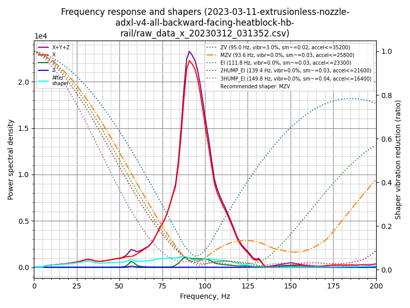
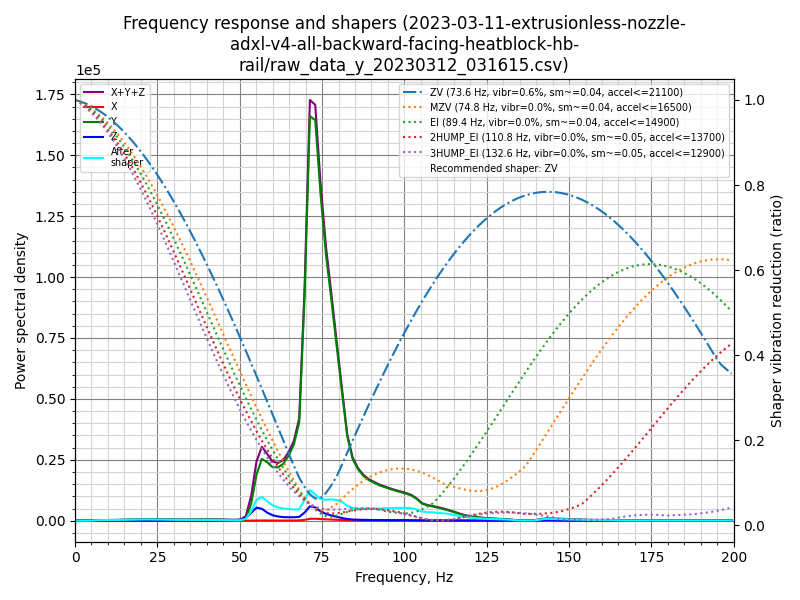
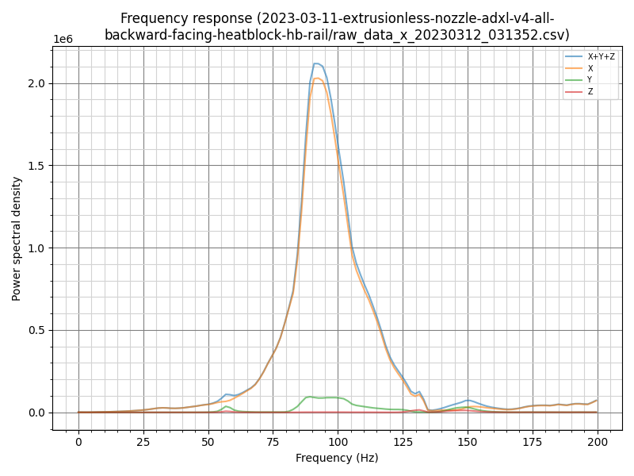
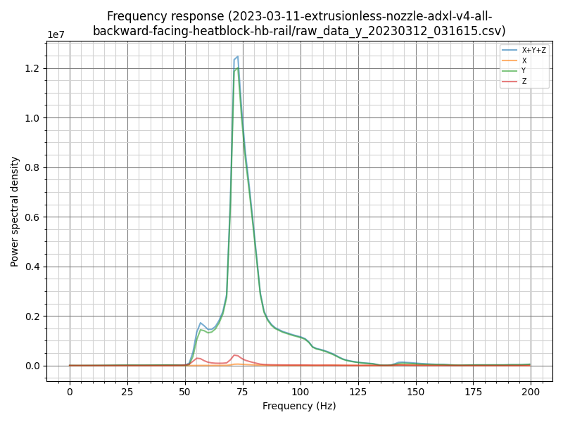

## Beta-3 Features

* balances the sensor by placing it in the center
* adds rigidity, from more material as well as built-in strengthening slots
* two-part front design reduces the area with supports, plus makes the design easier and faster to evolve
* supports Tap sensor boards
* easier to print:  you don't know need to worry about the bridge angle settings anymore
* enables the addition of V0.2-style rear heatsets
* bowden toolheads specific for beta-3 (the default bowden mini stealthburner toolhead has a lip that prevents it from seating properly).

## Instructions

Print 5 parts:
1. [a]_boop_center_optical.stl
2. boop_front.stl
3. boop_upper_optical.stl _or_ boop_upper_pcb.stl
4. magnet_carrier_left.stl
5. magnet_carrier_right.stl

For each, Voron-standard settings are recommended. The front and center pieces have internal features to improve rigidity, similar to how Tap does.

## BOM

The core Boop requires a sensor, short rail, magnets, and various fasteners. Boop beta-3 also adds support for OptoTap boards.

| Type | Part | Qty | Link | Note |
| - | - | - | - | - |
| Electronics | OPB991P51Z

2nd choice: OPB990P51Z | 1 | [Digi-Key: OPB991P51Z](https://www.digikey.com/en/products/detail/tt-electronics-optek-technology/OPB991P51Z/1637791)

2nd choice: [Digi-Key: OPB990P51Z](https://www.digikey.com/en/products/detail/tt-electronics-optek-technology/OPB990P51Z/1637770) | The 991 sensor is strongly recommended as it is safe for MCUs that cannot tolerate 5v input signals. If you have a MCU that is 5v safe then the 990 can be used. Please verify your MCUs capabilities before ordering! |
| | 220 ohm, 1/4 watt | 1 | | |
| Rail | MGN9H 50mm | 1 | | |
| Fasteners | M2x10 Self Tapping Screw | 1 | | |
| | M3x6 BHCS | 8 | | |
| | M3x8 BHCS | 2 | | |
| | M3x10 BHCS | 4 | | |
| | M3x6 FHCS | 2 | | black oxide or other magnetic alloy required |
| | M3x6 SHCS | 1 | | |
| | M3x8 SHCS | 1 | | |
| | M3x12 SHCS | 1 | | |
| | M3 Heatset Inserts | 9 | |
| | M3 Hex Nut | 1 | | |
| | M3 Washer | 2 | | |
| | 6mm n52 magnets | 2 | | |

## Technical Data

